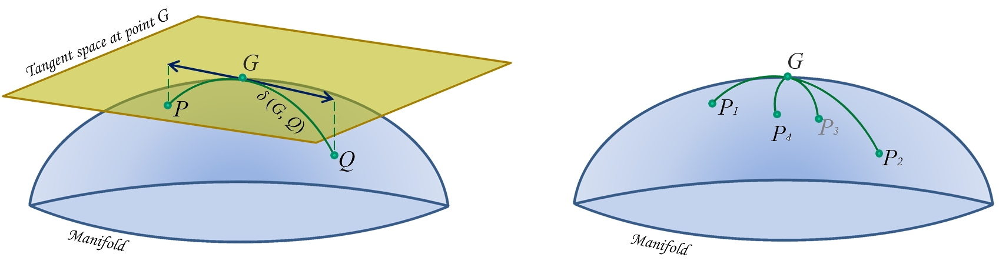

# PosDefManifold Documentation

## Installation

## Overview



## Code units

**PosDefManifold** includes five code units (.jl files):


| Unit   | Description |
|:----------:| ----------- |
| [PosDefManifold.jl](MainModule/index.html) | Main module |
| [riemannianGeometry.jl](riemannianGeometry/index.html) | The fundamental unit collecting all Riemannian functions |
| [linearAlgebra.jl](linearAlgebra/index.html) | Collection of linear algebra routines |
| [signalProcessing.jl](signalProcessing/index.html) | Collection of signal processing routines |
| [test.jl](test/index.html) | Unit performing all tests |


## Contents

```@contents
Pages = [ "index.md", "introToRiemannianGeometry.md", "MainModule.md", "riemannianGeometry.md", "linearAlgebra.md", "signalProcessing.md", "test.md"]
Depth = 1
```

## Index

```@index
```
